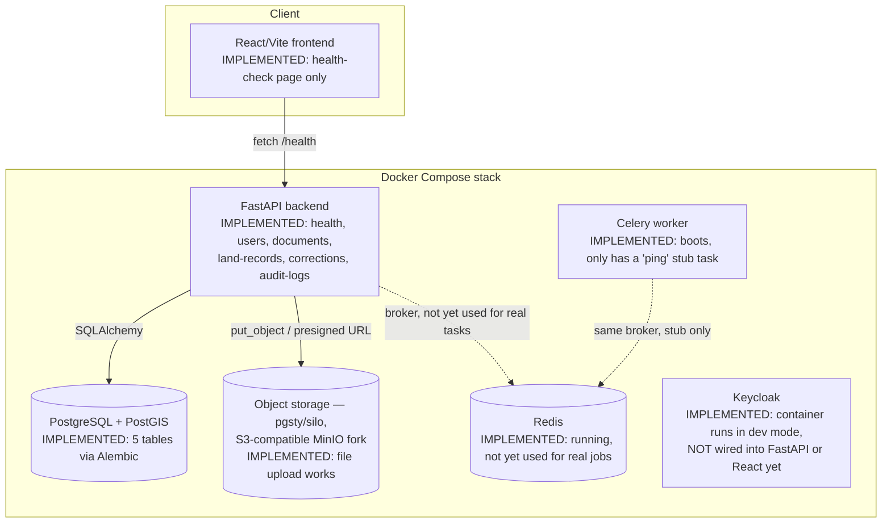

# BHUMI-SETU — Architecture

This describes what is **actually running**, not the end-state design.
Anything not explicitly marked "implemented" is planned.

## Current architecture (as of Phase 1 completion)

## Component breakdown

### Frontend — React/Vite
**Implemented:** a single page that calls `GET /health` on load and
displays the result. Nothing else exists yet — no routing, no upload UI,
no dashboard, no auth. **Planned:** upload UI, review/correction queue,
dashboard, Leaflet GIS map (Phase 6).

### Backend — FastAPI
**Implemented:**
- `app/main.py` — app entrypoint, CORS enabled for all origins (dev-only
  setting — tighten before production)
- `app/core/config.py` — all settings read from `.env` via pydantic-settings
- `app/core/celery_app.py` — Celery instance + one `ping` smoke-test task
- `app/core/storage.py` — MinIO/silo client wrapper (upload, presigned URL)
- `app/db/session.py` — SQLAlchemy engine/session, `Base` declarative class
- `app/models/` — 5 ORM models (see below)
- `app/schemas/` — Pydantic request/response models
- `app/api/` — routers: `health`, `users`, `documents`, `land_records`,
  `corrections`, `audit_logs`

**Not implemented:** authentication/authorization on any endpoint (all
routes are currently open), OCR integration, field extraction, background
job usage beyond the stub, validation/duplicate-detection logic,
hash-chaining logic on audit logs (columns exist, unused).

### Database — PostgreSQL + PostGIS
**Implemented:** 5 tables via Alembic migration — `users`, `documents`,
`land_records`, `corrections`, `audit_logs`. See `docs/API.md` for exact
fields exposed through the API, and the model files themselves for full
column definitions.

**Not implemented:** PostGIS geometry columns for plots (Phase 8 — the
extension is installed via the `postgis/postgis` image, but no geo-fields
exist on `LandRecord` yet), read replicas.

### Redis + Celery
**Implemented:** both containers run and can be reached (Celery worker
boots against the Redis broker, `ping` task works). **Not implemented:**
no real background job exists yet — OCR/extraction will move onto this
queue in Phase 4.

### Object storage — MinIO-compatible
**Implemented:** file upload on `POST /documents/upload` stores the raw
file in the bucket and records the object key as `storage_path` on the
`Document` row; a presigned download URL endpoint exists.
Note: using `pgsty/silo` rather than `minio/minio` — see `docs/DECISIONS.md`.

### Auth — Keycloak
**Implemented:** container runs in `start-dev` mode with default
admin/admin credentials. **Not implemented:** no realm/client
configuration, no OIDC integration with FastAPI or React, no role
enforcement anywhere. This is Phase 7 work. Right now, every API endpoint
is unauthenticated.

### OCR layer
**Not implemented at all yet.** Phase 2. Will sit behind a provider
abstraction interface (see `docs/PROJECT.md` and `docs/DECISIONS.md`) —
no code exists for this yet, including the interface itself.

## Deployment shape

Local dev: `docker compose up --build` runs all 7 services (db, redis,
minio/silo, keycloak, backend, celery_worker, frontend) as containers on
one machine. Kubernetes manifests are **planned** (Phase 10), not started.
